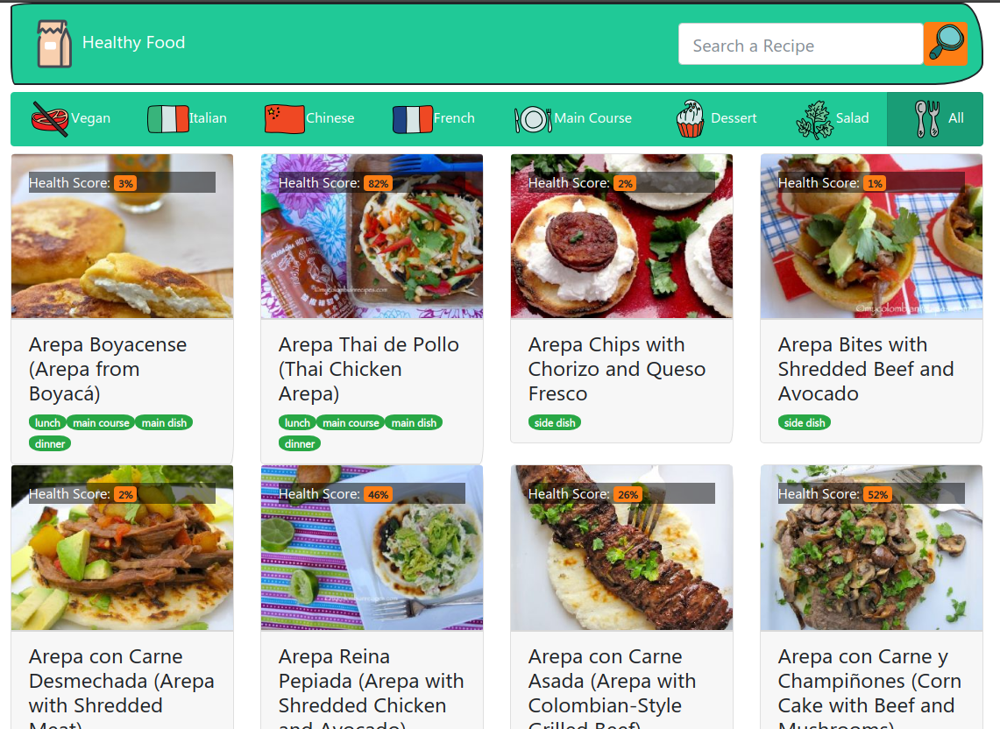
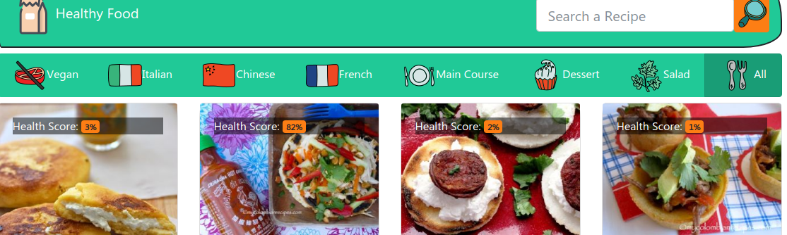
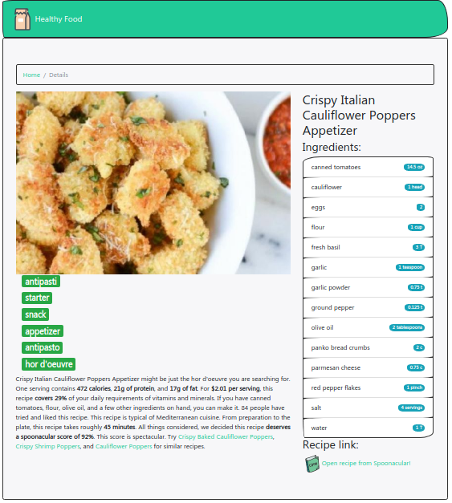
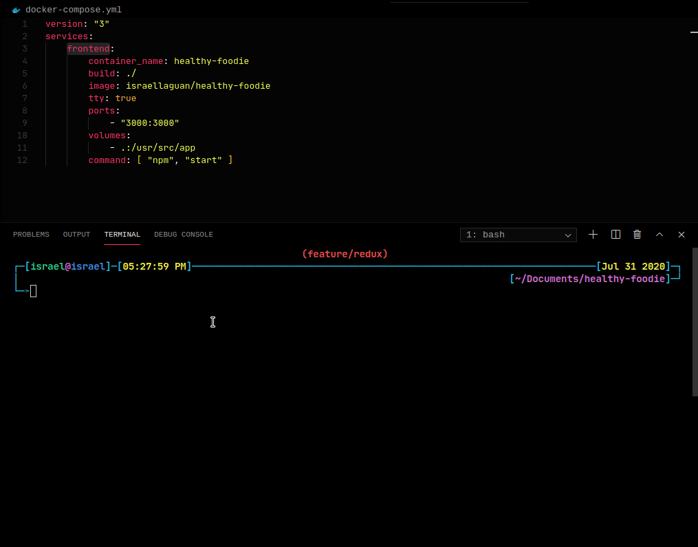
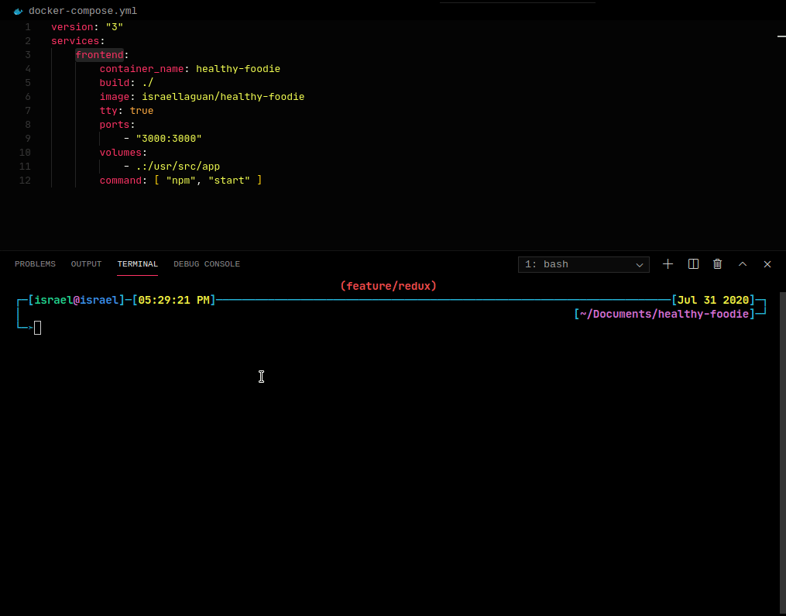
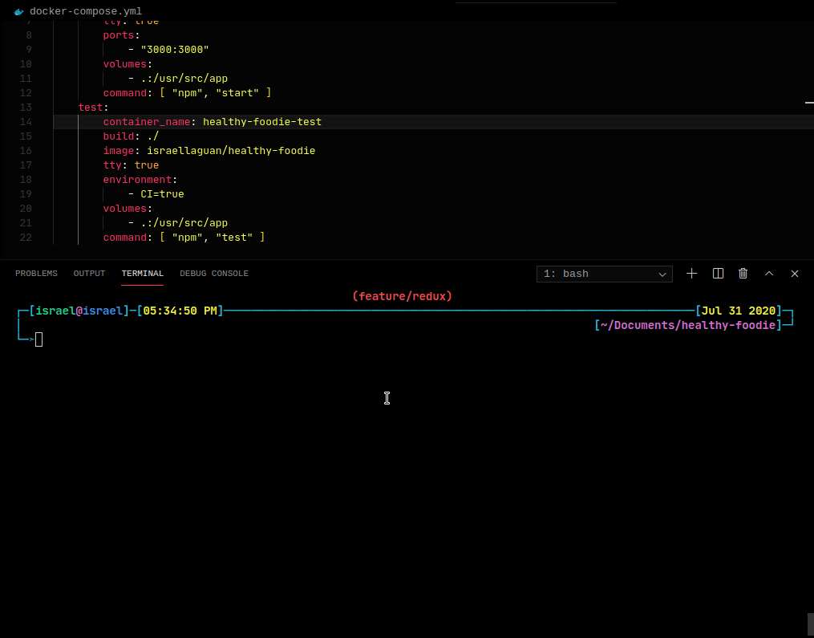

# Healthy Foodie - Recipes App (WIP)

<!-- PROJECT SHIELDS -->
[![Forks][forks-shield]][forks-url]
[![Stargazers][stars-shield]][stars-url]
[![Issues-open][issues-open-shield]][issues-url]
[![Issues-closed][issues-closed-shield]][issues-url]
[![Contributors][contributors-shield]][contributors-url]

<!-- PROJECT LOGO -->
| Healthy Foodie |
| :---: |
| ![app-icon][] |
| Recipes App ~ Get a list of recipes, filter or query as you like, and check the recipe! ~ Consuming an API with React and managinf state with Redux. |
| [🐞 Report a bug or 🙋‍♂️ request a feature][issues-url] |
| [![contributions welcome][contributions-welcome]][issues-url] [![License][badge-apache]][apache-license] |

- [Healthy Foodie - Recipes App (WIP)](#healthy-foodie---recipes-app-wip)
  - [The Project](#the-project)
    - [Features](#features)
    - [Built With](#built-with)
  - [Using the App](#using-the-app)
  - [How to run this project](#how-to-run-this-project)
    - [Prerequisites](#prerequisites)
    - [Run it (Quickstart with docker)](#run-it-quickstart-with-docker)
    - [Installing the project](#installing-the-project)
    - [Available Scripts](#available-scripts)
      - [`npm start`](#npm-start)
      - [`npm run build`](#npm-run-build)
    - [Learn More](#learn-more)
  - [Potential Features](#potential-features)
  - [Author](#author)
  - [Contributing](#contributing)
  - [Show your support](#show-your-support)
  - [License](#license)

## The Project

![app-banner][]

As part of Microverse Students, I have to complete some capstone projects, solo projects at the end of the each of the Microverse Main Technical Curriculum sections. This time is for React section.

This project is based in a catalogue of dogs [Catalogue of Dog Clothes](https://www.notion.so/Catalogue-of-Dog-Clothes-8bf1512b8ab34fa28848beb8ab698a32). As stated on the description I changed the subject (also I did not found any API on dog clothes :sad: ). I decided to make a catalogue of recipes. It would be useful and flashy; who doesn't loves to see pics of food!

### Features

![javascript][]
![react][]
[![Framework][badge-framework]][framework-url]
![bootstrap][]

- Basic `create-react-app` structure
- Sets `stylelint` on the repo
- Sets `eslint` rules
- Linters
- React
- React-DOM
- React-Create-App
- Redux
- PropTypes
- ES6 syntax
- Export/import ES6+ notation

### Built With

- `create-react-app`
- `ESLint`
- `npm`
- `vscode` with _ESLint_ extension
- Linux/GNU
- Love and Passion for code

## Using the App

- Open it and check some pre loaded recipes!



- Press a filter button to get recipes acording to the filter pressed



- Search in the navbar for your favorite recipe!

- Press any card from the list and see details like ingredients, nutricional info, and a link to the recipe:



## How to run this project

### Prerequisites

- `npm` 6.13 +
- `node` 11.15 +
- `docker` and `docker-compose` (optional)
- A Text Editor like VSCode
- A browser like Firefox or Chrome

### Run it (Quickstart with docker)

- Be sure to setup `docker-compose` and have `git` and `npm` working.
- Run this:

```sh
> git clone https://github.com/Israel-Laguan/healthy-foodie.git
> cd healthy-foodie
> npm i
> docker-compose build
> docker-compose up frontend
```

- Enter [localhost:3000][] in a browser for the frontend.





You can also test using docker, run `docker-compose up test` or `docker-compose run --rm test`



Not a fan of Docker or need more information? Continue for instructions to learn more about how to setup your PC for run the frontend!

We used `create-react-app` to initialize this project, so it is configurated to be easy to run. Just follow the following instructions.

### Installing the project

Now that you are set up, open a terminal and:

```sh
git clone https://github.com/Israel-Laguan/healthy-foodie.git
cd healthy-foodie
npm i && npm start
```

Then open [http://localhost:3000/](http://localhost:3000/) to see the app.


### Available Scripts

In the project directory, you can run:

#### `npm start`

Runs the app in the development mode.
Open [http://localhost:3000](http://localhost:3000) to view it in the browser.

The page will reload if you make edits.
You will also see any lint errors in the console.

#### `npm run build`

Builds the app for production to the `build` folder.
It correctly bundles React in production mode and optimizes the build for the best performance.

The build is minified and the filenames include the hashes.
Your app is ready to be deployed!

See the section about [deployment](https://facebook.github.io/create-react-app/docs/deployment) for more information.

### Learn More

You can learn more in the [Create React App documentation](https://facebook.github.io/create-react-app/docs/getting-started).

To learn React, check out the [React documentation](https://reactjs.org/).

## Potential Features

- [ ] Improves filtering (by calories, by ingredient, by money spent, etc.).
- [ ] Create a landing page.
- [ ] \<Insert your great idea here!>.

## Author

| [Israel Laguan][author-github] | ![email-icon][] Email me to [contact@israellaguan.com][author-email] / ![linkedin-icon][] Connect to [my Linkedin][author-linkedin] |
|:---:|:---:|
| ![author-pic][] | ![banner][] |

## Contributing

[![contributions welcome][contributions-welcome]][issues-url]

🤝 Contributions, issues and feature requests are welcome!
Feel free to check the [issues page][issues-url].

## Show your support

🤗 Give a ⭐️ if you like this project!

- API: Powered by [Spoonacular's Food API](https://spoonacular.com/food-api)
  
  ![spoonacular][api-logo]

- Icons from [![Icons8][icons8-logo]][Icons8] Icons8
- Banner from [canva.com](https://www.canva.com)
- Favicon from [favicon.io](https://favicon.io/emoji-favicons/)

## License

[![License][badge-apache]][apache-license]

📝 This project is licensed under the [Apache 2](LICENSE)\
Feel free to fork this project and improve it

<!-- MARKDOWN LINKS & IMAGES -->
[contributors-shield]: https://img.shields.io/github/contributors/Israel-Laguan/healthy-foodie?style=for-the-badge
[contributors-url]: https://github.com/Israel-Laguan/healthy-foodie/graphs/contributors
[forks-shield]: https://img.shields.io/github/forks/Israel-Laguan/healthy-foodie?style=for-the-badge
[forks-url]: https://github.com/Israel-Laguan/healthy-foodie/network/members
[stars-shield]: https://img.shields.io/github/stars/Israel-Laguan/healthy-foodie?style=for-the-badge
[stars-url]: https://github.com/Israel-Laguan/healthy-foodie/stargazers
[issues-open-shield]: https://img.shields.io/github/issues/Israel-Laguan/healthy-foodie?style=for-the-badge
[issues-closed-shield]: https://img.shields.io/github/issues-closed/Israel-Laguan/healthy-foodie?style=for-the-badge
[badge-framework]: https://img.shields.io/badge/store-Redux-000?style=for-the-badge&logo=redux
[framework-url]: https://redux.js.org/
[react]: https://img.shields.io/badge/React-16+-61DAFB?style=for-the-badge&logo=react
[javascript]: https://img.shields.io/badge/JAVASCRIPT-ES6%2B-F7DF1E?style=for-the-badge&logo=javascript
[css]: https://img.shields.io/badge/style-CSS-1572B6?style=for-the-badge&logo=css3
[bootstrap]: https://img.shields.io/badge/style-Bootstrap4-563D7C?style=for-the-badge&logo=bootstrap
[contributions-welcome]: https://img.shields.io/badge/contributions-welcome-brightgreen.svg?style=for-the-badge
[issues-url]: https://github.com/Israel-Laguan/healthy-foodie/issues
[badge-apache]: https://img.shields.io/badge/License-Apache%202.0-blue.svg?style=for-the-badge
[apache-license]: https://opensource.org/licenses/Apache-2.0
[author-pic]: https://avatars2.githubusercontent.com/u/36519478?s=460&v=4
[author-github]: https://israel-laguan.github.io
[author-linkedin]: https://www.linkedin.com/in/israellaguan
[author-email]: mailto:contact@israellaguan.com
[linkedin-icon]: https://img.icons8.com/color/20/000000/linkedin.png
[email-icon]: https://img.icons8.com/color/20/000000/message-squared.png
[banner]: https://github.com/Israel-Laguan/Israel-Laguan/raw/master/docs/banner.jpg
[app-banner]: docs/app-banner.png
[app-icon]: https://img.icons8.com/doodle/48/000000/cooking-book.png
[Icons8]: https://icons8.com/
[icons8-logo]: https://img.icons8.com/fluent/20/000000/icons8-new-logo.png
[api-logo]: https://spoonacular.com/images/spoonacular-logo-b.svg
